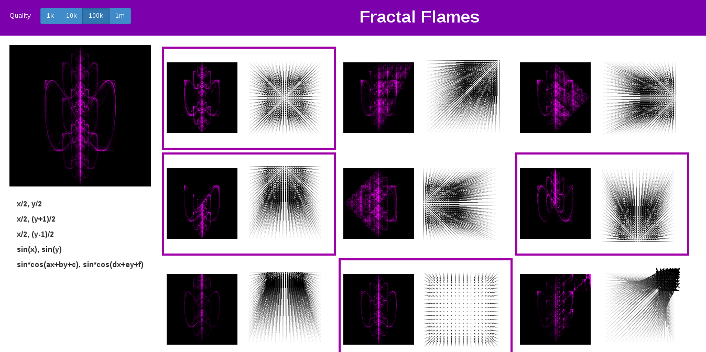
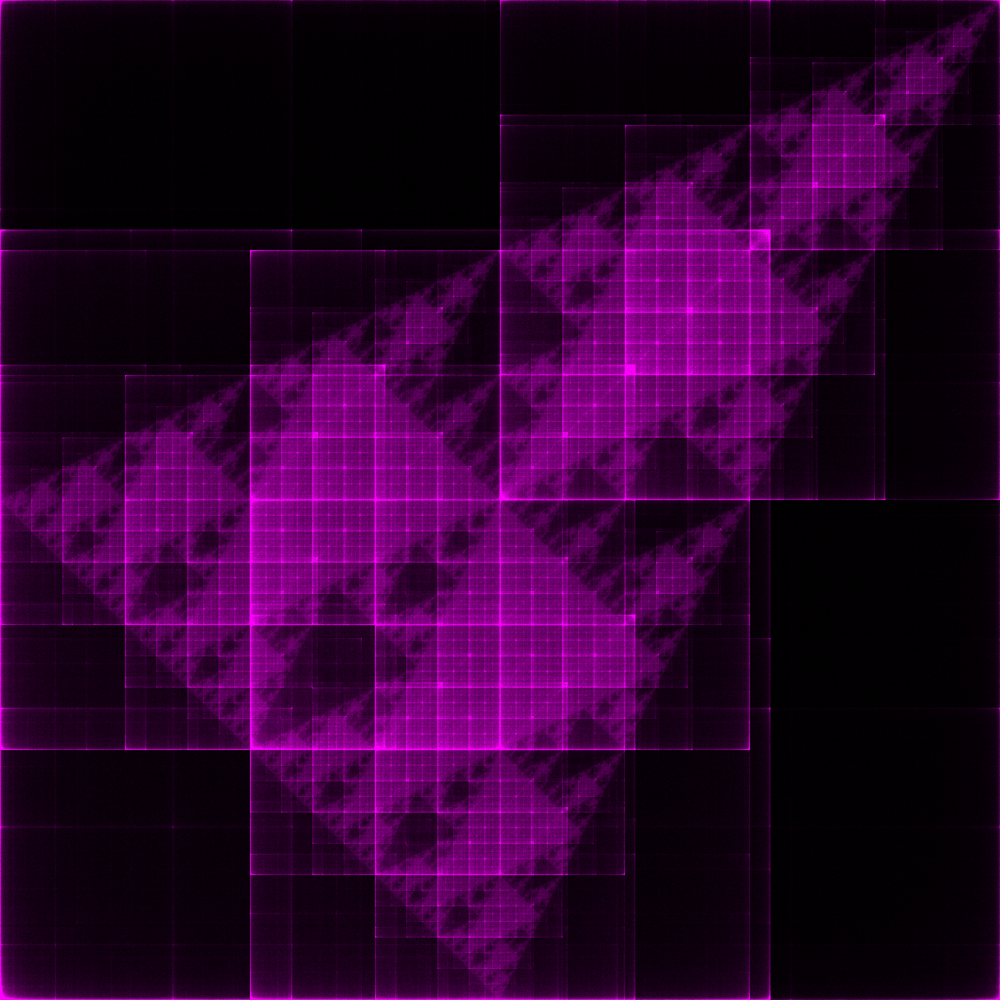
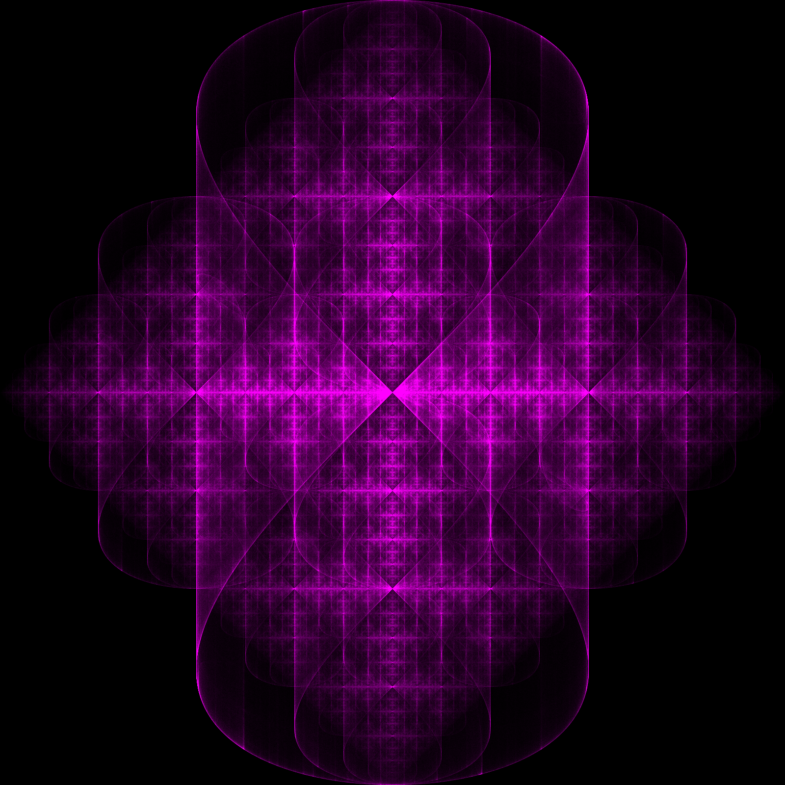
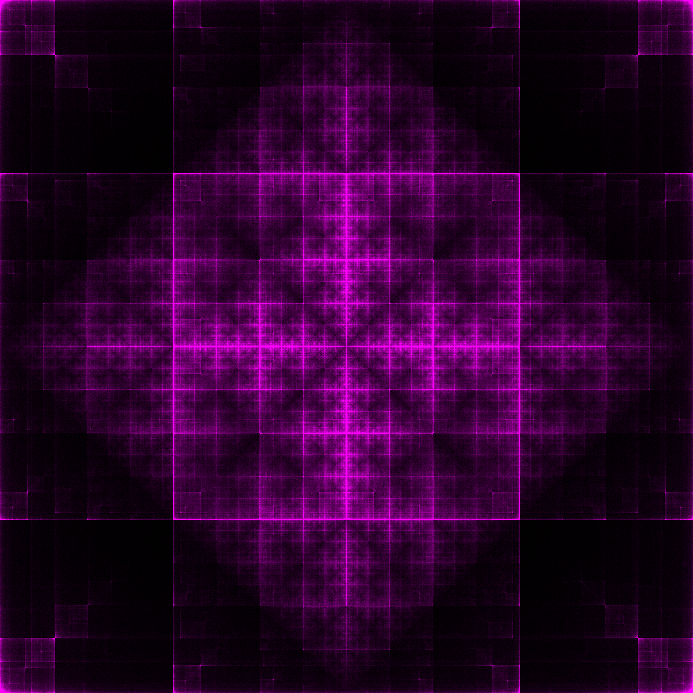
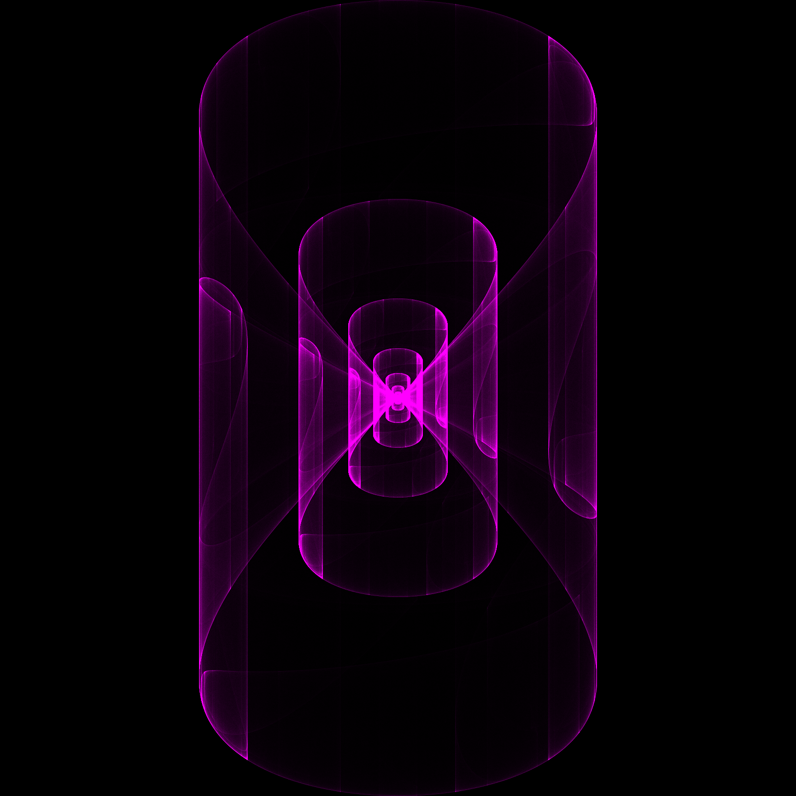

Flame Explorer
==============

Plumb the depths of the chaos fractal.

This web app provides a simple interface for exploring combinations of functions and the strange loops that result.

Powered by golang and the excellent martini web framework.

## Some example fractals

### Serpinski's Rocket

### Mystic Diamond

### Plaid Square

### Butterfly

